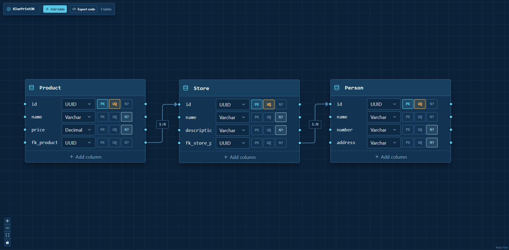
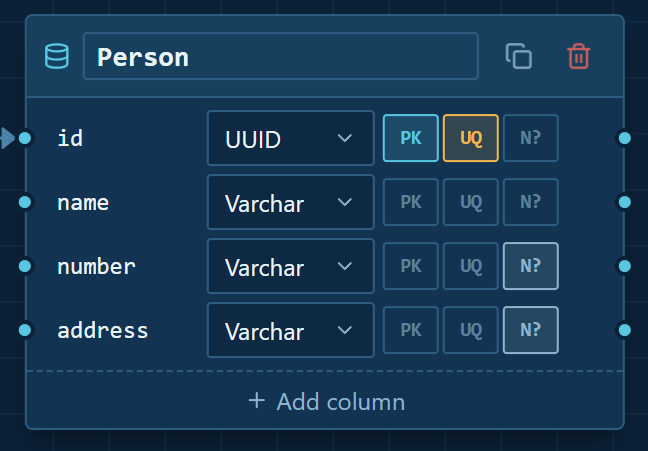
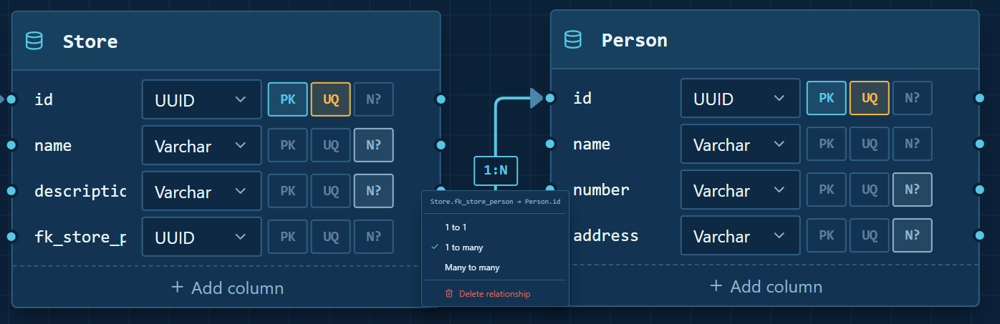
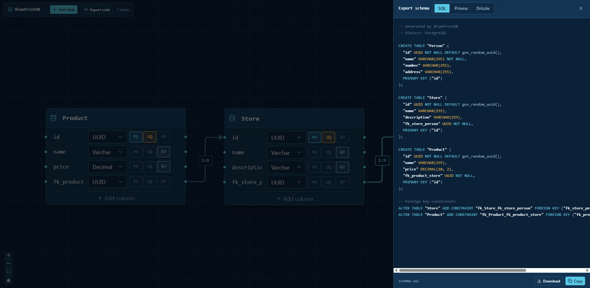

<div align="center">

# BluePrintDB

**Design your database schema visually. Export the exact SQL, Prisma, or Drizzle code to build it.**

100% client-side · No backend · No database connection required to design

[](https://nextjs.org)
[](https://www.typescriptlang.org)
[](https://reactflow.dev)
[](https://vercel.com/new/clone?repository-url=https://github.com/RafaelNTeixeira/BluePrintDB)

</div>

<br />

<p align="center">
  
</p>

<!--
  👋 Replace screenshots/hero.png (and the other files in /screenshots)
  with your own screenshots — see screenshots/README.md for exactly
  which files to add and tips for taking good ones.
-->

## What it is

BluePrintDB is a visual database schema designer that runs entirely in
your browser. Drag out tables, add typed columns, draw relationships
between them — and get back real, runnable **PostgreSQL**, **Prisma**, or
**Drizzle ORM** code the moment you need it. There's no database
connection, no account, and no server round-trip: the whole app is a
static Next.js site that keeps your schema in memory on the client.

## Features

**🗂️ Visual canvas**
- Pan/zoom canvas built on [React Flow](https://reactflow.dev)
- Right-click anywhere (or use the toolbar) to drop a new table
- Editable table names and columns directly on the node

**🧱 Table & column modeling**
- Data types: UUID, Int, BigInt, Float, Decimal, Varchar, Text, Boolean, Timestamp, Date, JSON
- Per-column **PK** / **UQ** / **N?** (nullable) toggles
- Duplicate or delete a table in one click

**🔗 Relationship mapping**
- Drag between column handles to connect two tables — anchored to the
  *exact* columns, not just the tables
- Click any relationship to set it to **1:1**, **1:N**, or **N:N**, or delete it
- Self-referential relationships (e.g. a `manager_id` pointing back at
  the same table) are handled correctly, including for many-to-many

**⚙️ Live code generation**
- **SQL** — `CREATE TABLE` statements, composite primary keys, auto-generated
  join tables for many-to-many, and `ALTER TABLE ... FOREIGN KEY` constraints
- **Prisma** — a complete `schema.prisma` with `@relation`-mapped fields,
  automatic disambiguation when a table has two FKs to the same parent
  (e.g. `author`/`editor`), and Prisma's implicit many-to-many
- **Drizzle** — a `pg-core` schema with correctly chained column builders,
  composite keys, join tables, and `relations()` blocks for the relational
  query API

**📋 Export panel**
- Tabs to switch between SQL / Prisma / Drizzle
- Syntax-highlighted, always in sync with the live canvas
- One-click **Copy to clipboard** or **Download** as a real file

## Screenshots

<table>
  <tr>
    <td width="29%">
      
      <p align="center"><sub>Table node — columns, types, and constraints</sub></p>
    </td>
    <td width="60%">
      
      <p align="center"><sub>Click a relationship to set 1:1 / 1:N / N:N</sub></p>
    </td>
  </tr>
  <tr>
    <td width="50%" colspan="2">
      
      <p align="center"><sub>Export panel — SQL, Prisma, or Drizzle, ready to copy</sub></p>
    </td>
  </tr>
</table>

## Tech stack

| Layer | Choice |
|---|---|
| Framework | [Next.js 14](https://nextjs.org) (App Router) |
| Canvas | [React Flow](https://reactflow.dev) |
| State | [Zustand](https://github.com/pmndrs/zustand) + Immer |
| Styling | [Tailwind CSS](https://tailwindcss.com) + [shadcn/ui](https://ui.shadcn.com)-style primitives (Radix UI) |
| Codegen | Hand-written generators in `lib/codegen/` — no external templating engine |

## Getting started

```bash
npm install
npm run dev
```

Open [http://localhost:3000](http://localhost:3000). That's it — no
environment variables, no database, nothing else to configure.

## Deploy to Vercel

This is a standard Next.js App Router project, so it deploys on Vercel
with zero configuration.

**Option A — one click:** push this repo to GitHub, then update the
"Deploy with Vercel" button at the top of this README with your repo URL,
or go to [vercel.com/new](https://vercel.com/new) and import the repo directly.

**Option B — CLI:**
```bash
npm i -g vercel
vercel
```

There's nothing else to set up — no environment variables, no database
provisioning, no build-step configuration. `npm run build` is all Vercel
needs to run.

## Project structure

```
blueprintdb/
├── app/
│   ├── layout.tsx            # Root layout, imports reactflow + global styles
│   ├── page.tsx               # Mounts the canvas
│   └── globals.css            # Tailwind + the blueprint color theme
├── components/
│   ├── schema-canvas.tsx      # The react-flow canvas: pan/zoom, right-click menu
│   ├── table-node.tsx         # Custom table node: columns, types, constraints
│   ├── relation-edge.tsx      # Interactive relationship line + type picker
│   ├── toolbar.tsx            # Add table / Export code
│   ├── export-panel.tsx       # Slide-out panel: tabs, copy, download
│   ├── code-block.tsx         # Syntax-highlighted code viewer
│   └── ui/                    # Button, Input, Select, Tabs, Dialog, etc.
├── lib/
│   ├── types.ts                # Column, TableNodeData, RelationEdgeData, ...
│   ├── store.ts                # Zustand store — the single source of truth
│   ├── syntax-highlight.ts     # Small dependency-free code highlighter
│   └── codegen/
│       ├── resolve-schema.ts   # Shared IR: resolves edges into concrete FKs
│       ├── generate-sql.ts
│       ├── generate-prisma.ts
│       ├── generate-drizzle.ts
│       └── index.ts            # generateCode(format, nodes, edges)
└── screenshots/                 # Drop your own screenshots here
```

## How it works

Everything on the canvas — every table, column, and relationship — lives
in a single Zustand store (`lib/store.ts`). The `lib/codegen/` module is
completely decoupled from React: it's a set of pure functions that take
the current `nodes`/`edges` arrays and return a string. The export panel
just calls `generateCode(format, nodes, edges)` on every render, so the
preview is always exactly what the canvas currently describes — there's
no separate "build" or "sync" step.

## Known limitations

- **No persistence yet** — the schema lives in memory and resets on page
  reload. (A natural next step would be `localStorage` or a shareable
  URL-encoded schema.)
- **Pluralization is a heuristic** — relation field names like `posts` or
  `following`/`followedBy` use a small best-effort English pluralizer, not
  a full NLP library. It only affects generated *field names*, never your
  actual table/column identifiers.
- **One SQL dialect** — the SQL export targets PostgreSQL specifically
  (e.g. `gen_random_uuid()`, `JSONB`).

## License

MIT — do whatever you'd like with it.

---
